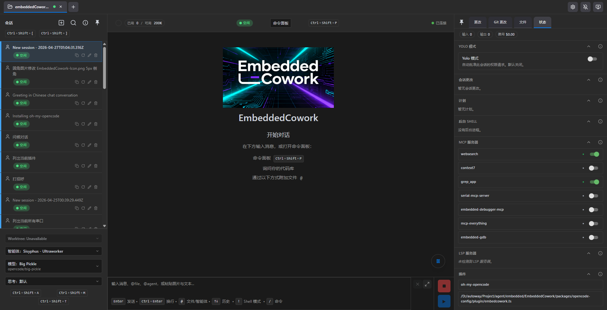

# EmbeddedCowork

## The AI Coding Cockpit for OpenCode

EmbeddedCowork transforms CodeNomad/OpenCode from a terminal tool into a **premium desktop workspace** — built for developers who live inside AI coding sessions for hours and need control, speed, and clarity.

> OpenCode gives you the engine. EmbeddedCowork gives you the cockpit.



---

## Features

- **🚀 Multi-Instance Workspace**
- **🌐 Remote Access**
- **🧠 Session Management**
- **🎙️ Voice Input & Speech**
- **🌳 Git Worktrees**
- **💬 Rich Message Experience**
- **🧩 SideCars**
- **⌨️ Command Palette**
- **📁 File System Browser**
- **🔐 Authentication & Security**
- **🔔 Notifications**
- **🎨 Theming**
- **🌍 Internationalization**

---

## Getting Started

### 🖥️ Desktop App

Available as both Electron and Tauri builds — choose based on your preference.

Download the latest installer for your platform from [Releases](https://github.com/shantur/EmbeddedCowork/releases).

| Platform | Formats |
|----------|---------|
| macOS | DMG, ZIP (Universal: Intel + Apple Silicon) |
| Windows | NSIS Installer, ZIP (x64, ARM64) |
| Linux | AppImage, deb, tar.gz (x64, ARM64) |

### 💻 EmbeddedCowork Server

Run as a local server and access via browser. Perfect for remote development.

```bash
npx @vividcode/embeddedcowork --launch
```

See [Server Documentation](packages/server/README.md) for flags, TLS, auth, and remote access.

### 🧪 Dev Releases

Bleeding-edge builds from the `dev` branch:

```bash
npx @vividcode/embeddedcowork-dev --launch
```

---

## SideCars

SideCars let you open local web tools inside EmbeddedCowork as tabs.

<details>
<summary><strong>Configuration</strong></summary>

- **Name**: Display name used in EmbeddedCowork
- **Port**: Local HTTP or HTTPS service running on `127.0.0.1:<port>`
- **Base path**: Mounted under `/sidecars/:id`
- **Prefix mode**:
  - **Preserve prefix** forwards the full `/sidecars/:id/...` path upstream
  - **Strip prefix** removes `/sidecars/:id` before forwarding the request upstream

</details>

<details>
<summary><strong>VSCode (OpenVSCode Server)</strong></summary>

Run with Docker:

```bash
docker run -it --init -p 8000:3000 -v "${HOME}:${HOME}:cached" -e HOME=${HOME} gitpod/openvscode-server --server-base-path /sidecars/vscode
```

Add SideCar as:

- **Name**: `VSCode`
- **Port**: `http://127.0.0.1:8000`
- **Base path**: `/sidecars/vscode`
- **Prefix mode**: `Preserve prefix`

</details>

<details>
<summary><strong>Terminal (ttyd)</strong></summary>

Run with:

```bash
ttyd --writable zsh
```

Add SideCar as:

- **Name**: `Terminal`
- **Port**: `http://127.0.0.1:7681`
- **Base path**: `/sidecars/terminal`
- **Prefix mode**: `Strip prefix`

</details>

---

## Requirements

- **[OpenCode CLI](https://opencode.ai)** — must be installed and in your `PATH`
- **Node.js 18+** — for server mode or building from source

---

## Development

EmbeddedCowork is a monorepo built with:

| Package | Description |
|---------|-------------|
| **[packages/server](packages/server/README.md)** | Core logic & CLI — workspaces, OpenCode proxy, API, auth, speech |
| **[packages/ui](packages/ui/README.md)** | SolidJS frontend — reactive, fast, beautiful |
| **[packages/electron-app](packages/electron-app/README.md)** | Desktop shell — process management, IPC, native dialogs |
| **[packages/tauri-app](packages/tauri-app)** | Tauri desktop shell (experimental) |

### Quick Start

```bash
git clone https://github.com/vividcode-ai/EmbeddedCowork.git
cd EmbeddedCowork
npm install
npm run dev
```

---

## Troubleshooting

<details>
<summary><strong>macOS: "EmbeddedCowork.app is damaged and can't be opened"</strong></summary>

Gatekeeper flag due to missing notarization. Clear the quarantine attribute:

```bash
xattr -dr com.apple.quarantine /Applications/EmbeddedCowork.app
```

On Intel Macs, also check **System Settings → Privacy & Security** on first launch.
</details>

<details>
<summary><strong>Linux (Wayland + NVIDIA): Tauri App closes immediately</strong></summary>

WebKitGTK DMA-BUF/GBM issue. Run with:

```bash
WEBKIT_DISABLE_DMABUF_RENDERER=1 embeddedcowork
```

See full workaround in the original README.
</details>

---

## Community

[](https://star-history.com/#vividcode-ai/EmbeddedCowork&Date)

---

感谢以下开源项目：

- [CodeNomad](https://github.com/NeuralNomadsAI/CodeNomad) -跨平台桌面版本 
- [opencode](https://github.com/anomalyco/opencode) - AI Agent


**Built with ♥ by [VividCode](https://github.com/vividcode-ai)** · [MIT License](LICENSE)
